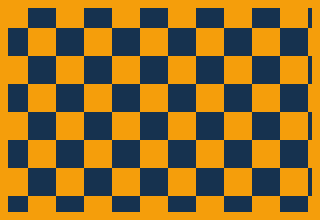

# generator-repair-fun-ad-video

HyperFrames 直式短影音廣告專案，主題是「專修發電機」。

規格：

- 尺寸：1080 x 1920
- 長度：25 秒
- 場景：7 scenes
- 用途：FB / Threads / IG Reels / LINE / Google 商家 / 網站首頁

## 如何建立 / 預覽

原需求指定：

```bash
npx hyperframes init generator-repair-fun-ad-video
```

目前這台環境沒有 `node`、`npx`、`ffmpeg`，所以本專案已手動建立為 HyperFrames 可執行結構。安裝 Node 22+ 與 FFmpeg 後，在本資料夾執行：

```bash
npx hyperframes preview
```

瀏覽器直接預覽也可以：

```bash
python3 -m http.server 8000
```

然後打開：

```text
http://127.0.0.1:8000/generator-repair-fun-ad-video/index.html?preview=1
```

`?preview=1` 會在一般瀏覽器中自動播放。  
`?seek=13.5` 可跳到指定秒數檢查畫面。

## 檢查指令

```bash
npx hyperframes lint
npx hyperframes inspect
```

## 輸出 MP4

```bash
npx hyperframes render --output renders/generator-repair-fun-ad.mp4 --quality high
```

## 如何替換 Logo

替換：

```text
assets/logo.png
```

目前影片以 CSS 品牌字樣為主，若要在結尾顯示真實 logo，可在 `index.html` 搜尋 `.brand-badge` 或 Scene 7 的 CTA 區塊，改成 ``。

## 如何替換師傅圖片

替換：

```text
assets/mechanic.png
```

目前使用 CSS 插畫師傅。若要改成真實圖片，搜尋 `.mechanic`，可把內部 CSS 結構替換成：

```html

```

## 如何替換發電機圖片

替換：

```text
assets/generator.png
```

目前使用 CSS 插畫發電機。若要改成圖片，搜尋 `.generator`，替換成圖片容器即可。

## 如何修改電話、LINE、服務地區

在 `index.html` 搜尋：

```text
電話：請替換
LINE：請替換
服務地區：請替換
```

或直接搜尋 `.contact-line`，改 Scene 7 的 CTA 文字。

## 如何調整影片秒數

1. 修改 root composition 的 `data-duration="25"`。
2. 調整 JS 裡每個 `transitionToScene(...)` 的開始秒數。
3. 調整每幕入口動畫秒數與最後停留時間。
4. 重新跑：

```bash
npx hyperframes lint
npx hyperframes inspect
```

## 如何改成橫式版本

1. 將 root 的 `data-width="1920"`、`data-height="1080"`。
2. 將 `body`、`#generator-repair-fun-ad`、`.scene` 寬高改為 1920 x 1080。
3. 把 `.scene-content` 改成左右分區，文字在左、角色與發電機在右。
4. 情境卡片由直式堆疊改成橫向排列。
5. 重新檢查：

```bash
npx hyperframes inspect
```

## Placeholder Assets

`assets/` 內已保留以下可替換檔名：

```text
logo.png
mechanic.png
generator.png
toolbox.png
wrench.png
multimeter.png
smoke.png
spark.png
construction-site.jpg
storefront.jpg
event-power.jpg
home-backup.jpg
texture.jpg
```

目前影片主要使用 CSS 插畫，因此素材可逐步替換，不會阻塞預覽。

